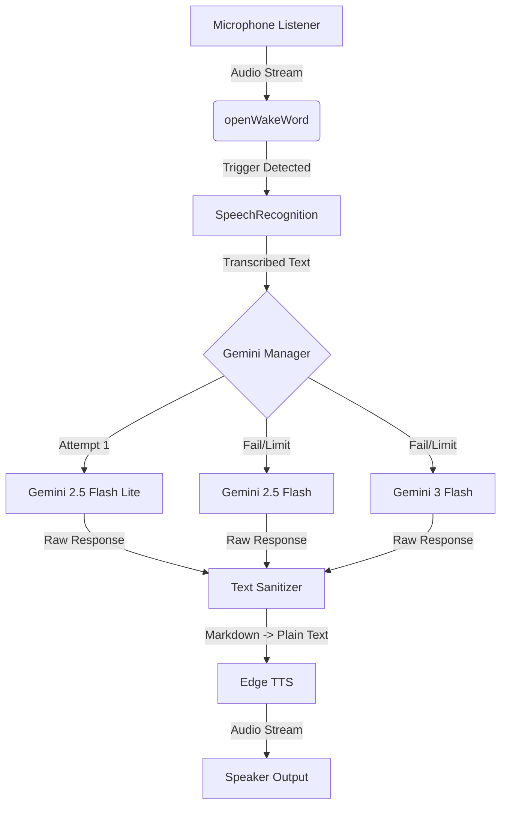

# AI Voice Assistant

A robust, modular voice assistant framework built to run on a Raspberry Pi (or any Windows/Linux machine). This project leverages **Google Gemini** for intelligence and **Microsoft Edge TTS** for neural speech synthesis.

## Software Architecture

### Core Pipeline

1.  **Wake Word Detection (`openWakeWord`)**: 
    - Continuously listens to the microphone stream.
    - Uses an ONNX-based model to detect the trigger phrase ("Hey Jarvis") locally on device with low latency.
    
2.  **Speech-to-Text (`SpeechRecognition`)**:
    - Once triggered, listens for a user command.
    - Transcribes audio using Google's Speech Recognition API.
    - *Timeout*: 5s silence detection, 30s max phrase limit.

3.  **Intelligence (`google-generativeai`)**:
    - Sends the transcribed text to the **Gemini API**.
    - **Stateless Operation**: Each query is treated independently (no chat history) for speed and simplicity.
    - **Dynamic Model Fallback**: 
        - Tries `gemini-2.5-flash-lite` (Fastest)
        - Fallback: `gemini-2.5-flash`
        - Fallback: `gemini-3-flash` (Most Capable)
    - **Rate Limit Handling**: Automatically handles 429/404 errors by switching models. Defaults to 2.5 flash lite because it gives the fastest responses.

4.  **Text Processing (`markdown` + `bs4`)**:
    - Gemini often returns complex Markdown (bolding, lists, code blocks).
    - **Sanitization**: 
        - Converts Markdown to HTML.
        - Uses `BeautifulSoup` to extract clean, plain text.
        - Collapses whitespace for smooth speech synthesis (need to work on more human-like speech delivery).

5.  **Text-to-Speech (`edge-tts` + `playsound3`)**:
    - Converts the cleaned text to audio using the **Microsoft Edge TTS** API.
    - **Voice**: `en-GB-RyanNeural` (British English).
    - **Playback**: Audio is saved to a temporary file and played via `playsound3`.

## Hardware Requirements

*   **Compute**: Raspberry Pi 4/5 (or any Windows/Linux PC)
*   **Microphone**: USB Condenser Mic
*   **Speaker**: USB Speakers
  
Note: I used USB components because the Raspberry Pi 5 doesn't have a 3.5mm jack for audio i/o

## Installation

1.  **Clone the Repository**:
    ```bash
    git clone https://github.com/RahulCheen/RasPi-Gemini-Assistant.git
    cd RasPi-Gemini-Assistant
    ```

2.  **Environment Setup**:
    The project includes automated setup scripts to handle system dependencies, virtual environment creation, and Python requirements.

    **For Raspberry Pi / Linux / Mac**:
    ```bash
    chmod +x setup.sh
    ./setup.sh
    ```

    **For Windows (PowerShell)**:
    ```powershell
    .\setup_windows.ps1
    ```
    
    *Note: You may need to run `Set-ExecutionPolicy Unrestricted` if scripts are blocked.*

3.  **Configuration**:
    - Create a `config.json` file in the root directory:
    ```json
    {
        "GEMINI_API_KEY": "YOUR_GEMINI_API_KEY",
        "WAKE_WORD_MODEL": "hey_jarvis"
    }
    ```

## Usage

Run the main assistant loop:
```bash
python main.py
```

### Testing TTS
To test the voice synthesis in isolation (useful for debugging audio drivers):
```bash
python test_tts.py
```

## Workflow Diagram


